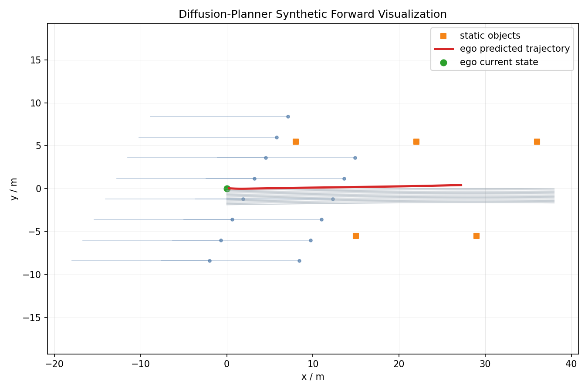
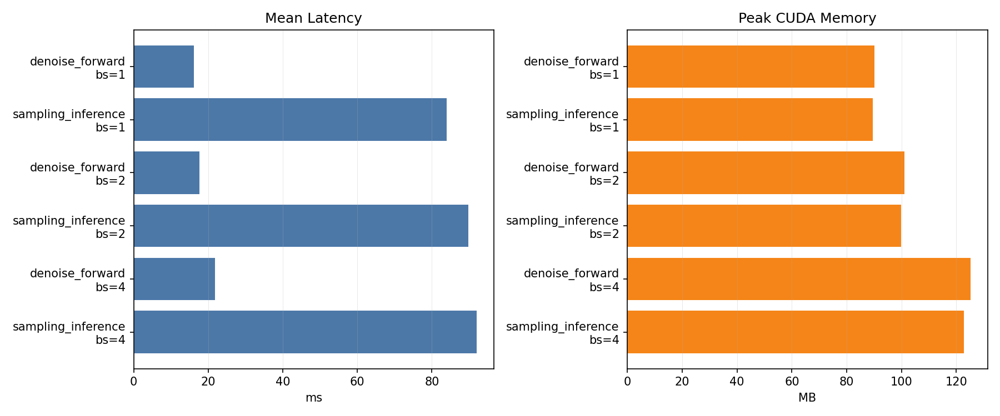

# Diffusion-Planner Reproduction and Projectization

> 基于 ICLR 2025 自动驾驶规划论文 Diffusion-Planner 的复现、工程化整理与实验分析项目。

本仓库不是 Diffusion-Planner 官方源码仓库，而是一个个人项目化复现仓库。它围绕官方项目完成环境搭建、checkpoint 加载、CUDA 前向验证、synthetic trajectory 可视化、推理 benchmark、nuPlan 数据集接入说明和面试/简历材料整理。

官方来源:

- Paper / Project: Diffusion-Based Planning for Autonomous Driving with Flexible Guidance
- Official GitHub: https://github.com/ZhengYinan-AIR/Diffusion-Planner
- Official Checkpoint: https://huggingface.co/ZhengYinan2001/Diffusion-Planner
- nuPlan Devkit: https://github.com/motional/nuplan-devkit

## 1. 项目目标

这个项目的目标不是简单地说“跑过一次代码”，而是把一个自动驾驶规划论文项目整理成可以展示、可以复查、可以继续扩展的个人工程项目。

当前已经完成:

- 复现 Diffusion-Planner 核心模型链路
- 搭建 Python 3.9 + PyTorch 2.0 + CUDA 11.8 环境
- 集成 `nuplan-devkit`
- 下载并加载官方 HuggingFace checkpoint
- 验证模型可以在本机 GPU 上完成 synthetic batch 前向传播
- 验证 checkpoint 权重与模型结构完整匹配
- 验证 `DiffusionPlanner` planner 类和 `run_simulation` 入口可以导入
- 生成 synthetic trajectory 可视化图
- 完成推理延迟 benchmark
- 整理模型结构、环境调试、项目局限、面试讲稿和简历写法

当前尚未完成:

- 未跑完整 nuPlan closed-loop benchmark
- 未复现论文 Val14/Test14 表格指标
- 未重新训练模型
- 未生成真实 nuPlan 场景的 nuBoard 可视化

原因: 完整 closed-loop simulation 需要 nuPlan 官方数据集和 maps。本仓库当前提供数据集检查脚本和运行模板，数据集到位后可以继续推进。

## 2. 为什么这个项目有意义

自动驾驶规划需要在复杂交互场景中生成未来轨迹。传统方法常把 prediction 和 planning 拆开处理，而 Diffusion-Planner 将 ego vehicle planning 和 surrounding agents prediction 统一成条件轨迹生成问题。

Diffusion-Planner 的核心思想:

- 用 diffusion model 从噪声中逐步生成未来轨迹
- 用场景上下文作为条件，包括邻车、车道、路线和静态障碍物
- 联合建模 ego vehicle 和关键 neighbor agents
- 支持 classifier guidance，在采样过程中加入安全或碰撞相关约束

这个项目能体现的能力:

- 自动驾驶 planning / prediction 项目复现
- nuPlan benchmark 工具链理解
- 生成式模型在轨迹规划任务中的应用
- PyTorch / CUDA 环境搭建与调试
- 研究代码工程化整理
- 模型推理 benchmark 和结果分析

## 3. 仓库结构

```text
.
├── README.md
├── environment.yml
├── docs
│   ├── benchmarking.md
│   ├── debugging_log.md
│   ├── interview_notes.md
│   ├── limitations.md
│   ├── model_architecture.md
│   ├── next_experiments.md
│   ├── nuplan_data_setup.md
│   └── resume_versions.md
├── results
│   ├── inference_benchmark.csv
│   ├── inference_benchmark.png
│   └── synthetic_forward_trajectory.png
└── scripts
    ├── benchmark_inference.py
    ├── bootstrap_repos.ps1
    ├── check_nuplan_data.ps1
    ├── download_checkpoint.ps1
    ├── project_utils.py
    ├── run_simulation_template.ps1
    ├── verify_checkpoint.py
    ├── verify_forward.py
    └── visualize_synthetic_trajectory.py
```

说明:

- `work/` 不提交到 GitHub，用于存放上游 Diffusion-Planner 和 nuPlan-devkit 源码。
- 官方 `model.pth` 不提交到 GitHub，使用脚本从 HuggingFace 下载。
- `results/` 中保留轻量结果图和 benchmark CSV，便于项目展示。

## 4. 快速开始

### 4.1 克隆本项目

```powershell
git clone https://github.com/ljw826732773-png/diffusion_planner_project.git
cd diffusion_planner_project
```

### 4.2 创建 Conda 环境

```powershell
conda env create -f environment.yml
conda activate diffusion_planner
```

如果环境创建中遇到 PyTorch CUDA wheel 下载问题，可以先手动安装:

```powershell
pip install torch==2.0.0+cu118 torchvision==0.15.1+cu118 `
  --find-links https://download.pytorch.org/whl/torch_stable.html
```

### 4.3 拉取上游代码和 checkpoint

```powershell
scripts\bootstrap_repos.ps1
```

这个脚本会执行:

- clone `ZhengYinan-AIR/Diffusion-Planner` 到 `work/Diffusion-Planner`
- clone `motional/nuplan-devkit` 到 `work/nuplan-devkit`
- 下载 `args.json` 和 `model.pth` 到 `work/Diffusion-Planner/checkpoints`

如果想同时安装 editable 包:

```powershell
scripts\bootstrap_repos.ps1 -InstallEditable
```

也可以手动安装:

```powershell
python -m pip install setuptools==59.5.0 wheel==0.37.1
python -m pip install --no-build-isolation --no-use-pep517 -e work\nuplan-devkit
python -m pip install --no-build-isolation --no-use-pep517 -e work\Diffusion-Planner
```

## 5. 已完成验证

### 5.1 CUDA 和模型前向传播

运行:

```powershell
python scripts\verify_forward.py
```

本机验证结果:

```text
device=cuda
torch=2.0.0+cu118
cuda_available=True
cuda_device=NVIDIA GeForce RTX 3060 Laptop GPU
encoding_shape=(1, 107, 192)
score_shape=(1, 11, 81, 4)
score_isfinite=True
```

解释:

- `encoding_shape=(1, 107, 192)` 表示 batch size 为 1，场景 token 数为 107，hidden dim 为 192。
- `score_shape=(1, 11, 81, 4)` 表示输出 1 个 ego + 10 个 neighbor，共 11 个主体；每个主体包含当前 1 帧 + 未来 80 帧；每帧状态为 `x, y, cos(heading), sin(heading)`。
- `score_isfinite=True` 说明输出没有 NaN 或 Inf。

### 5.2 Checkpoint 加载

运行:

```powershell
python scripts\verify_checkpoint.py
```

本机验证结果:

```text
checkpoint_keys=['model', 'ema_state_dict']
loaded_params=276
missing=0
unexpected=0
planner_import=ok
```

解释:

- 官方 checkpoint 中包含 `model` 和 `ema_state_dict`。
- 当前使用 EMA 权重加载。
- `missing=0` 和 `unexpected=0` 表示模型结构和 checkpoint 完全匹配。

## 6. Synthetic 轨迹可视化

运行:

```powershell
python scripts\visualize_synthetic_trajectory.py
```

输出:

```text
results/synthetic_forward_trajectory.png
```

示例:



注意: 这张图来自 synthetic scene，只用于验证模型输出、绘图逻辑和项目展示，不代表真实 nuPlan 场景表现。

## 7. 推理 Benchmark

运行:

```powershell
python scripts\benchmark_inference.py --batch-sizes 1,2,4 --iterations 50 --sampling-iterations 20
```

输出:

```text
results/inference_benchmark.csv
results/inference_benchmark.png
```

结果图:



当前 RTX 3060 Laptop GPU 上的 synthetic benchmark:

| Mode | Batch | Mean Latency | Calls/s | Samples/s | Peak CUDA Memory |
| --- | ---: | ---: | ---: | ---: | ---: |
| denoise_forward | 1 | 16.20 ms | 61.73 | 61.73 | 90.1 MB |
| sampling_inference | 1 | 84.04 ms | 11.90 | 11.90 | 89.6 MB |
| denoise_forward | 2 | 17.72 ms | 56.44 | 112.87 | 101.2 MB |
| sampling_inference | 2 | 89.84 ms | 11.13 | 22.26 | 99.9 MB |
| denoise_forward | 4 | 21.84 ms | 45.79 | 183.15 | 125.1 MB |
| sampling_inference | 4 | 92.01 ms | 10.87 | 43.47 | 122.8 MB |

结论:

- 单次去噪网络前向约 16-22 ms。
- 完整 10-step diffusion sampling 约 84-92 ms。
- sampling inference 比单次 forward 更慢，说明 diffusion planner 的主要推理开销来自多步采样。
- batch size 从 1 到 4 时，单次调用延迟变化不大，样本吞吐明显提高。
- 当前 benchmark 使用 synthetic inputs，不代表真实 nuPlan closed-loop 指标。

## 8. nuPlan 数据集接入

当前没有提交 nuPlan 数据集，仓库只保存代码、文档、脚本和轻量结果图。完整 closed-loop simulation 需要在本机配置数据路径，推荐放在非 C 盘:

```powershell
$env:NUPLAN_DATA_ROOT="D:\nuplan-data\dataset"
$env:NUPLAN_MAPS_ROOT="D:\nuplan-data\dataset\maps"
$env:NUPLAN_EXP_ROOT="D:\nuplan-data\exp"
```

下载 nuPlan mini 和地图:

```powershell
scripts\download_nuplan_mini.ps1
```

默认会优先下载到 `D:\nuplan-data\dataset`，避免把 10GB 级别数据放进项目目录或 C 盘。也可以手动指定:

```powershell
scripts\download_nuplan_mini.ps1 -DatasetRoot "D:\nuplan-data\dataset"
```

这个脚本会做三件事:

- 下载 `nuplan-maps-v1.0.zip` 和 `nuplan-v1.1_mini.zip`。
- 校验已下载文件大小，支持断点续传，已有完整 zip 不会重下。
- 适配 AWS mini zip 的解压结构: 如果 `.db` 出现在 `data\cache\mini`，会创建 junction 到 `nuplan-v1.1\splits\mini`，不重复复制 8GB 数据。

当前本地已验证的数据状态:

- `D:\nuplan-data\dataset\data\cache\mini`: 64 个 mini `.db`
- `D:\nuplan-data\dataset\nuplan-v1.1\splits\mini`: junction，指向上面的 mini 数据
- `D:\nuplan-data\dataset\maps`: 4 个城市地图和 metadata
- `D:\nuplan-data\exp`: 仿真输出目录

检查数据是否就绪:

```powershell
scripts\check_nuplan_data.ps1 `
  -NuplanDataRoot "D:\nuplan-data\dataset" `
  -NuplanMapsRoot "D:\nuplan-data\dataset\maps" `
  -NuplanExpRoot "D:\nuplan-data\exp"
```

检查内容:

- `mini` / `trainval` / `test` 下是否有 `.db`
- 是否存在 `sensor_blobs`
- 是否存在 `nuplan-maps-v1.0.json`
- 是否找到 4 个城市地图的 `map.gpkg`

closed-loop simulation 模板:

```powershell
scripts\run_simulation_template.ps1 `
  -NuplanDataRoot "D:\nuplan-data\dataset" `
  -NuplanMapsRoot "D:\nuplan-data\dataset\maps" `
  -NuplanExpRoot "D:\nuplan-data\exp" `
  -ScenarioBuilder "nuplan_mini" `
  -Split "one_of_each_scenario_type" `
  -Worker "sequential" `
  -ExperimentUid "dp/mini/model"
```

Windows 下建议保持 `ExperimentUid` 较短，避免 simulation log 路径触发 260 字符限制。

本地 mini closed-loop 烟测结果:

| 项目 | 结果 |
| --- | --- |
| challenge | `closed_loop_nonreactive_agents` |
| scenario_filter | `one_of_each_scenario_type` |
| 场景数 | 1 |
| 成功 / 失败 | 1 / 0 |
| scenario type | `near_multiple_vehicles` |
| scenario token | `1f151e15c9cf5c81` |
| 仿真 duration | 54.19 s |
| compute trajectory mean runtime | 0.328 s |

记录见:

- [results/mini_simulation_smoke_test.md](results/mini_simulation_smoke_test.md)

小规模 mini 评估:

```powershell
conda run -n diffusion_planner powershell -ExecutionPolicy Bypass `
  -File .\outputs\diffusion_planner_project\scripts\run_mini_eval.ps1 `
  -NuplanDataRoot "D:\nuplan-data\dataset" `
  -NuplanMapsRoot "D:\nuplan-data\dataset\maps" `
  -NuplanExpRoot "D:\nuplan-data\exp" `
  -ScenarioBuilder "nuplan_mini" `
  -ScenarioFilter "one_of_each_scenario_type" `
  -Worker "sequential" `
  -LimitTotalScenarios 5 `
  -ExperimentUid "dp/mini5/model" `
  -SummaryPrefix "mini_eval"
```

5 场景 mini closed-loop 评估结果:

| 项目 | 结果 |
| --- | --- |
| challenge | `closed_loop_nonreactive_agents` |
| scenario_filter | `one_of_each_scenario_type` |
| 场景数 | 5 |
| 成功 / 失败 | 5 / 0 |
| final weighted score | 0.9254 |
| mean simulation duration | 134.7063 s |
| mean trajectory runtime | 0.8146 s |

轻量结果文件:

- [results/mini_eval_summary.md](results/mini_eval_summary.md)
- [results/mini_eval_runner_report.csv](results/mini_eval_runner_report.csv)
- [results/mini_eval_aggregated_metrics.csv](results/mini_eval_aggregated_metrics.csv)
- [results/mini_eval_metric_scores.csv](results/mini_eval_metric_scores.csv)

更多说明见:

- [docs/nuplan_data_setup.md](docs/nuplan_data_setup.md)
- [docs/mini_eval_workflow.md](docs/mini_eval_workflow.md)

## 9. 模型结构理解

Diffusion-Planner 的核心流程:

1. 将 ego 当前状态、邻车历史、车道、路线和静态障碍物整理成模型输入。
2. Encoder 分别编码 agent、lane、static object token。
3. Fusion encoder 用 attention 融合场景上下文。
4. Decoder 使用 DiT 风格结构，在 diffusion time 条件下生成未来轨迹。
5. 推理阶段通过 DPM-Solver 进行多步采样，输出 ego future trajectory。

更详细说明见:

- [docs/model_architecture.md](docs/model_architecture.md)

## 10. 环境调试记录

复现过程中解决的关键问题:

- Windows 默认 `python` 指向 Store stub，不适合直接使用
- `nuplan-devkit` 老式 `setup.py develop` 与新版 setuptools 冲突
- NumPy 2.x 与 PyTorch/TorchVision ABI 不兼容
- OpenCV 新版要求 NumPy 2.x，与 Torch 栈冲突
- 新版 wandb 会升级 protobuf，与 TensorBoard 2.11.2 冲突
- GIS 依赖中 rasterio 版本需要和 NumPy 版本匹配
- nuPlan 地图模块使用 Linux/POSIX `fcntl`，Windows 原生缺失

更详细说明见:

- [docs/debugging_log.md](docs/debugging_log.md)

## 11. 当前局限

本项目可以说明:

- Diffusion-Planner 核心模型链路已打通
- 官方 checkpoint 能完整加载
- 模型可以在 CUDA 上完成 synthetic forward
- planner 入口可以导入
- 可以完成 synthetic benchmark 和可视化

本项目还不能说明:

- 完整复现论文 closed-loop 指标
- 在 nuPlan Val14/Test14 上达到论文性能
- 完成真实场景 closed-loop simulation
- 完成模型训练

更详细说明见:

- [docs/limitations.md](docs/limitations.md)

## 12. 后续计划

优先级从高到低:

1. 下载并配置 nuPlan mini，跑少量真实 closed-loop simulation。
2. 生成真实 scenario 的 nuBoard 或自定义轨迹可视化。
3. 做 sampling steps ablation，例如 5/10/20/50 steps 的速度与轨迹质量对比。
4. 做 classifier guidance demo，对比 no guidance 和 collision guidance。
5. 整理真实场景失败案例和分析。

更多计划见:

- [docs/next_experiments.md](docs/next_experiments.md)

## 13. 简历和面试怎么讲

一句话版本:

> 复现并工程化整理 ICLR 2025 Diffusion-Planner 自动驾驶规划模型，完成 nuPlan-devkit 集成、官方 checkpoint 加载、CUDA 前向推理、synthetic 轨迹可视化和推理 benchmark，并分析扩散模型在多智能体轨迹规划中的应用。

适合岗位:

- 自动驾驶规划算法工程师
- 自动驾驶预测算法工程师
- 机器人运动规划工程师
- 具身智能算法工程师
- 深度学习算法工程师
- 机器学习工程师

更多材料:

- [docs/resume_versions.md](docs/resume_versions.md)
- [docs/interview_notes.md](docs/interview_notes.md)

## 14. References

```bibtex
@inproceedings{
zheng2025diffusionbased,
title={Diffusion-Based Planning for Autonomous Driving with Flexible Guidance},
author={Yinan Zheng and Ruiming Liang and Kexin ZHENG and Jinliang Zheng and Liyuan Mao and Jianxiong Li and Weihao Gu and Rui Ai and Shengbo Eben Li and Xianyuan Zhan and Jingjing Liu},
booktitle={The Thirteenth International Conference on Learning Representations},
year={2025},
url={https://openreview.net/forum?id=wM2sfVgMDH}
}
```
